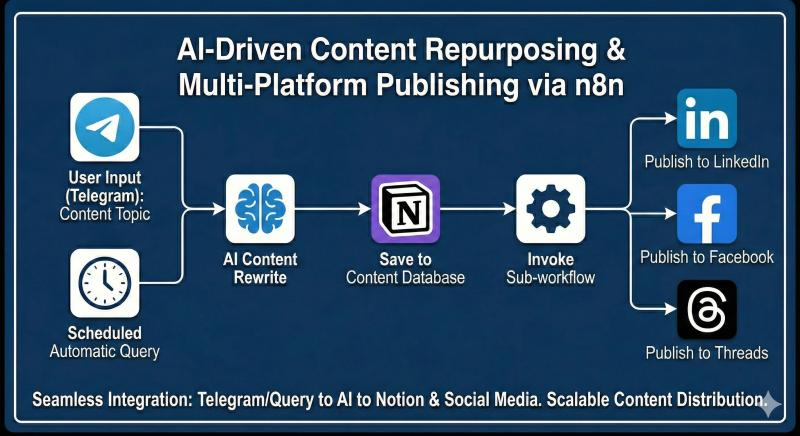

# AI-Driven Content Automation & Multi-Platform Publishing System

## 🚀 Project Overview
Designed and implemented an end-to-end content automation system that streamlines topic intake, AI-assisted content generation, centralized content management, and automated multi-platform publishing. This solution emphasizes scalability, modular workflow design, and long-term maintainability.

## 🛠️ Key Technical Features
* **Layered Architecture:** Decoupled content generation, storage, and distribution layers.
* **Modular Design:** Built reusable child workflows to enable platform-specific publishing (e.g., LinkedIn, Notion) without impacting core logic.
* **Centralized Management:** Uses Notion as a "Single Source of Truth" for centralized content storage and lifecycle management.
* **Standardized AI Output:** Implemented event-driven workflows with prompt standardization to ensure consistent brand voice across platforms.

## 🏗️ Solution Architecture

*This diagram illustrates the high-level orchestration, highlighting the decoupled design and the use of sub-workflows for multi-platform distribution.*
1. **Input Layer:** Topic submission via messaging interface and automated discovery.
2. **Processing Layer:** AI-based content rewriting with standardized prompt engineering.
3. **Orchestration Layer:** Parent workflow managing the lifecycle and triggering specific child workflows.
4. **Distribution Layer:** Automated publishing to multiple platforms via reusable adapters.

## 📈 Impact & Business Value
* **Efficiency:** Established a reusable automation blueprint adaptable to different content strategies.
* **Reliability:** Reduced manual content handling and repetitive publishing tasks.
* **Consistency:** Improved the reliability of multi-platform distribution while maintaining consistent structures.
